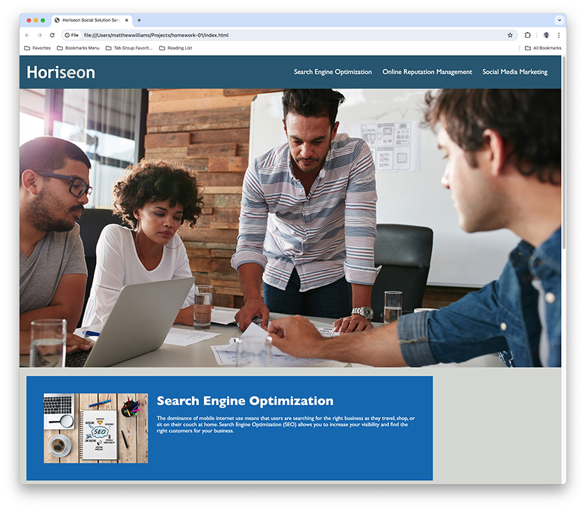

# Code Refactor Starter Code

## Description
Matthew Williams performed the Refactor. The task was to improve the Horiseon landing page without changing it's appearance or function to improve its accessiblity, accuracy, and load time. This revised code consolidates many redundant css styles, organizes them logically, fixes a broken link in the html, and adds enhancements like auto-updating copyright date and absolute-positioning the menubar.

## Installation
The Horiseon landing page requires no installation. However, because it's an unhosted exercise, download the repository to your device.

## Usage
Launch the Horiseon landing page by double-clicking on index.html. The page is responsive, so it will display correctly on most devices. The list of services in the menu bar are hyperlinked to sections on the page; click a service to jump to that section.

You can access the repository at https://github.com/MatthewWilliamsCMH/code-refactor. A screenshot of the page is below.

## License
MIT

## Unresolved Bug
The id links jump to the top of the viewport and, thus, are partially hidden behind the menubar.